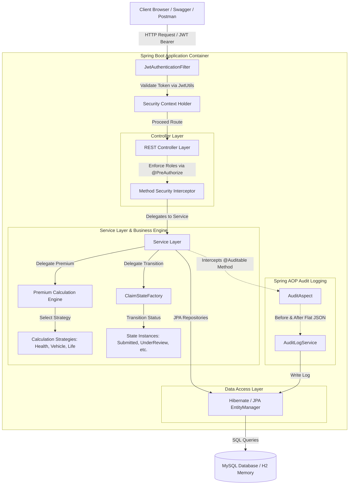

# System Architecture Diagram

This document visualizes the runtime layered architecture, security boundaries, and AOP aspects of **InsureFlow Enterprise**.

```mermaid
graph TD
    Client[Client Browser / Swagger / Postman] -->|HTTP Request / JWT Bearer| SecurityFilter[JwtAuthenticationFilter]
    
    subgraph Spring Boot Container [Spring Boot Application Container]
        SecurityFilter -->|Validate Token via JwtUtils| SecurityContext[Security Context Holder]
        SecurityContext -->|Proceed Route| Controller[REST Controller Layer]
        
        subgraph Controllers [Controller Layer]
            Controller -.->|Enforce Roles via @PreAuthorize| MethodSecurity[Method Security Interceptor]
        end
        
        MethodSecurity -->|Delegates to Service| Service[Service Layer]
        
        subgraph Services [Service Layer & Business Engine]
            Service -->|Delegate Premium| PremiumEngine[Premium Calculation Engine]
            PremiumEngine -->|Select Strategy| Strat[Calculation Strategies: Health, Vehicle, Life]
            
            Service -->|Delegate Transition| StateFactory[ClaimStateFactory]
            StateFactory -->|Transition Status| States[State Instances: Submitted, UnderReview, etc.]
        end
        
        subgraph AOP Aspect [Spring AOP Audit Logging]
            Service -.->|Intercepts @Auditable Method| Aspect[AuditAspect]
            Aspect -.->|Before & After Flat JSON| AuditService[AuditLogService]
        end
        
        subgraph Persistence [Data Access Layer]
            Service -->|JPA Repositories| JPA[Hibernate / JPA EntityManager]
            AuditService -->|Write Log| JPA
        end
    end
    
    JPA -->|SQL Queries| DB[(MySQL Database / H2 Memory)]
```
