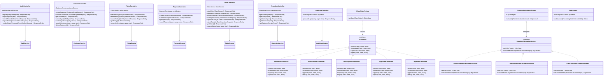

# Class Diagram

This document visualizes the class hierarchies, strategic interfaces, and layered dependencies for the **InsureFlow Enterprise** application.

```mermaid
classDiagram
    class AuthController {
        -AuthService authService
        +register(RegisterRequest) ResponseEntity
        +login(LoginRequest) ResponseEntity
        +refreshToken(RefreshTokenRequest) ResponseEntity
        +requestReset(PasswordResetRequest) ResponseEntity
        +confirmReset(PasswordResetConfirmRequest) ResponseEntity
    }

    class CustomerController {
        -CustomerService customerService
        +createCustomer(CustomerCreateRequest) ResponseEntity
        +updateCustomer(id, CustomerUpdateRequest) ResponseEntity
        +getCustomer(id) ResponseEntity
        +uploadKyc(id, MultipartFile) ResponseEntity
        +updateKycStatus(id, KycStatus) ResponseEntity
        +searchCustomers(query, page, size) ResponseEntity
        +deleteCustomer(id) ResponseEntity
    }

    class PolicyController {
        -PolicyService policyService
        +createPolicy(PolicyCreateRequest) ResponseEntity
        +renewPolicy(id, PolicyRenewRequest) ResponseEntity
        +cancelPolicy(id, PolicyCancelRequest) ResponseEntity
        +getPolicy(id) ResponseEntity
        +searchPolicies(query, page, size) ResponseEntity
    }

    class PaymentController {
        -PaymentService paymentService
        +createPayment(PaymentRequest) ResponseEntity
        +createRefund(RefundRequest) ResponseEntity
        +getPayment(id) ResponseEntity
        +searchPayments(query, page, size) ResponseEntity
    }

    class ClaimController {
        -ClaimService claimService
        +raiseClaim(ClaimRequest) ResponseEntity
        +uploadDocument(id, MultipartFile) ResponseEntity
        +reviewClaim(id, ClaimTransitionRequest) ResponseEntity
        +investigateClaim(id, ClaimTransitionRequest) ResponseEntity
        +approveClaim(id, ClaimTransitionRequest) ResponseEntity
        +rejectClaim(id, ClaimTransitionRequest) ResponseEntity
        +getClaim(id) ResponseEntity
        +searchClaims(query, page, size) ResponseEntity
    }

    class ReportingController {
        -ReportingService reportingService
        +getSummaryReport() ResponseEntity
        +getPolicyReport() ResponseEntity
        +getClaimReport() ResponseEntity
        +getRevenueReport() ResponseEntity
        +getCustomerGrowthReport() ResponseEntity
    }

    class AuditLogController {
        -AuditLogService auditLogService
        +getAuditLogs(query, page, size) ResponseEntity
    }

    AuthController --> AuthService
    CustomerController --> CustomerService
    PolicyController --> PolicyService
    PaymentController --> PaymentService
    ClaimController --> ClaimService
    ReportingController --> ReportingService
    AuditLogController --> AuditLogService

    class ClaimState {
        <<interface>>
        +review(Claim, notes, actor)
        +investigate(Claim, notes, actor)
        +approve(Claim, notes, actor)
        +reject(Claim, notes, actor)
    }

    class SubmittedClaimState {
        +review(Claim, notes, actor)
        +investigate(Claim, notes, actor)
        +approve(Claim, notes, actor)
        +reject(Claim, notes, actor)
    }
    class UnderReviewClaimState {
        +review(Claim, notes, actor)
        +investigate(Claim, notes, actor)
        +approve(Claim, notes, actor)
        +reject(Claim, notes, actor)
    }
    class InvestigationClaimState {
        +review(Claim, notes, actor)
        +investigate(Claim, notes, actor)
        +approve(Claim, notes, actor)
        +reject(Claim, notes, actor)
    }
    class ApprovedClaimState {
        +review(Claim, notes, actor)
        +investigate(Claim, notes, actor)
        +approve(Claim, notes, actor)
        +reject(Claim, notes, actor)
    }
    class RejectedClaimState {
        +review(Claim, notes, actor)
        +investigate(Claim, notes, actor)
        +approve(Claim, notes, actor)
        +reject(Claim, notes, actor)
    }

    ClaimState <|.. SubmittedClaimState
    ClaimState <|.. UnderReviewClaimState
    ClaimState <|.. InvestigationClaimState
    ClaimState <|.. ApprovedClaimState
    ClaimState <|.. RejectedClaimState

    class ClaimStateFactory {
        +getState(ClaimStatus) ClaimState
    }

    ClaimStateFactory ..> ClaimState : creates

    class PremiumCalculationStrategy {
        <<interface>>
        +getPolicyType() PolicyType
        +calculatePremium(PremiumCalculationInput) BigDecimal
    }

    class HealthPremiumCalculationStrategy {
        +getPolicyType() PolicyType
        +calculatePremium(PremiumCalculationInput) BigDecimal
    }
    class VehiclePremiumCalculationStrategy {
        +getPolicyType() PolicyType
        +calculatePremium(PremiumCalculationInput) BigDecimal
    }
    class LifePremiumCalculationStrategy {
        +getPolicyType() PolicyType
        +calculatePremium(PremiumCalculationInput) BigDecimal
    }

    PremiumCalculationStrategy <|.. HealthPremiumCalculationStrategy
    PremiumCalculationStrategy <|.. VehiclePremiumCalculationStrategy
    PremiumCalculationStrategy <|.. LifePremiumCalculationStrategy

    class PremiumCalculationEngine {
        -Map strategies
        +calculate(PremiumCalculationInput) BigDecimal
    }

    PremiumCalculationEngine o--> PremiumCalculationStrategy : delegates

    class AuditAspect {
        -AuditLogService auditLogService
        +auditAround(ProceedingJoinPoint, Auditable) Object
    }
```
