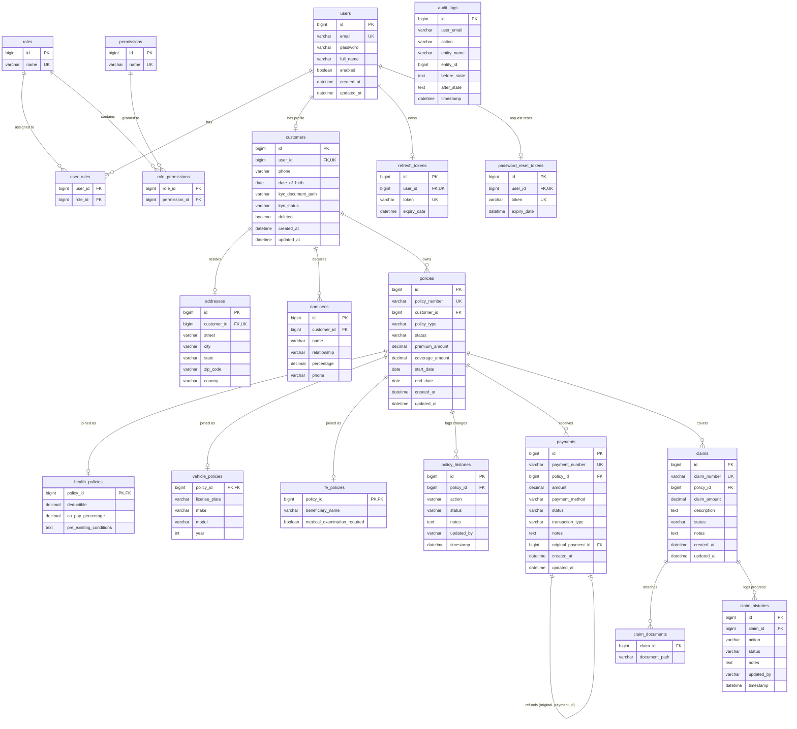

# Entity Relationship Diagram (ERD)

This document visualizes the database schema for the **InsureFlow Enterprise** application.

```mermaid
erDiagram
    users {
        bigint id PK
        varchar email UK
        varchar password
        varchar full_name
        boolean enabled
        datetime created_at
        datetime updated_at
    }

    roles {
        bigint id PK
        varchar name UK
    }

    permissions {
        bigint id PK
        varchar name UK
    }

    user_roles {
        bigint user_id FK
        bigint role_id FK
    }

    role_permissions {
        bigint role_id FK
        bigint permission_id FK
    }

    customers {
        bigint id PK
        bigint user_id FK, UK
        varchar phone
        date date_of_birth
        varchar kyc_document_path
        varchar kyc_status
        boolean deleted
        datetime created_at
        datetime updated_at
    }

    addresses {
        bigint id PK
        bigint customer_id FK, UK
        varchar street
        varchar city
        varchar state
        varchar zip_code
        varchar country
    }

    nominees {
        bigint id PK
        bigint customer_id FK
        varchar name
        varchar relationship
        decimal percentage
        varchar phone
    }

    policies {
        bigint id PK
        varchar policy_number UK
        bigint customer_id FK
        varchar policy_type
        varchar status
        decimal premium_amount
        decimal coverage_amount
        date start_date
        date end_date
        datetime created_at
        datetime updated_at
    }

    health_policies {
        bigint policy_id PK, FK
        decimal deductible
        decimal co_pay_percentage
        text pre_existing_conditions
    }

    vehicle_policies {
        bigint policy_id PK, FK
        varchar license_plate
        varchar make
        varchar model
        int year
    }

    life_policies {
        bigint policy_id PK, FK
        varchar beneficiary_name
        boolean medical_examination_required
    }

    policy_histories {
        bigint id PK
        bigint policy_id FK
        varchar action
        varchar status
        text notes
        varchar updated_by
        datetime timestamp
    }

    payments {
        bigint id PK
        varchar payment_number UK
        bigint policy_id FK
        decimal amount
        varchar payment_method
        varchar status
        varchar transaction_type
        text notes
        bigint original_payment_id FK
        datetime created_at
        datetime updated_at
    }

    claims {
        bigint id PK
        varchar claim_number UK
        bigint policy_id FK
        decimal claim_amount
        text description
        varchar status
        text notes
        datetime created_at
        datetime updated_at
    }

    claim_documents {
        bigint claim_id FK
        varchar document_path
    }

    claim_histories {
        bigint id PK
        bigint claim_id FK
        varchar action
        varchar status
        text notes
        varchar updated_by
        datetime timestamp
    }

    audit_logs {
        bigint id PK
        varchar user_email
        varchar action
        varchar entity_name
        bigint entity_id
        text before_state
        text after_state
        datetime timestamp
    }

    refresh_tokens {
        bigint id PK
        bigint user_id FK, UK
        varchar token UK
        datetime expiry_date
    }

    password_reset_tokens {
        bigint id PK
        bigint user_id FK, UK
        varchar token UK
        datetime expiry_date
    }

    users ||--o{ user_roles : "has"
    roles ||--o{ user_roles : "assigned to"
    roles ||--o{ role_permissions : "contains"
    permissions ||--o{ role_permissions : "granted to"

    users ||--o| customers : "has profile"
    users ||--o| refresh_tokens : "owns"
    users ||--o| password_reset_tokens : "request reset"

    customers ||--o| addresses : "resides"
    customers ||--o{ nominees : "declares"
    customers ||--o{ policies : "owns"

    policies ||--o| health_policies : "joined as"
    policies ||--o| vehicle_policies : "joined as"
    policies ||--o| life_policies : "joined as"
    policies ||--o{ policy_histories : "logs changes"
    policies ||--o{ payments : "receives"
    policies ||--o{ claims : "covers"

    payments ||--o| payments : "refunds (original_payment_id)"
    claims ||--o{ claim_documents : "attaches"
    claims ||--o{ claim_histories : "logs progress"
```
