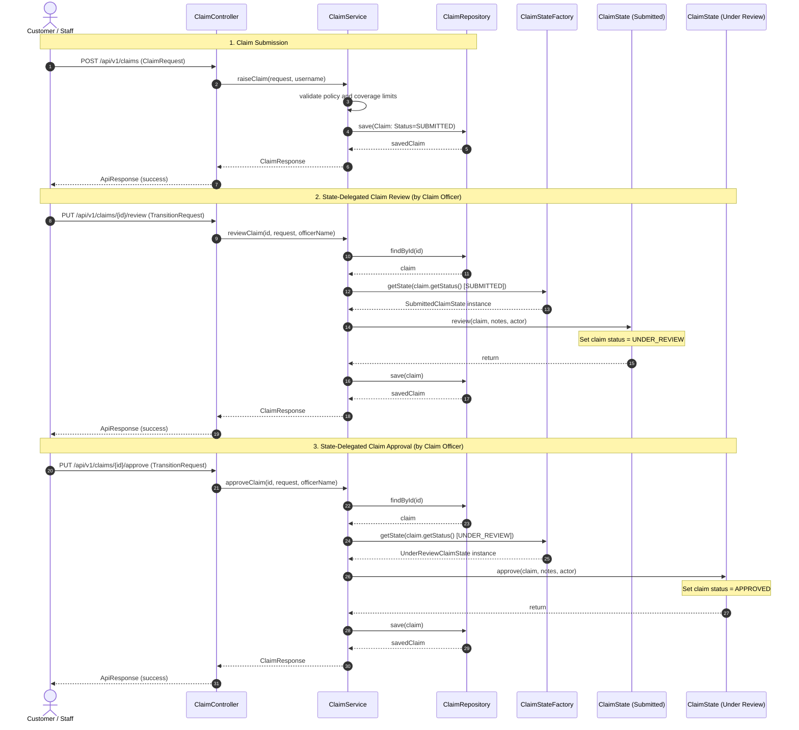

# Sequence Diagram

This document visualizes the sequence flow of policy creation, premium calculation, and the state-delegated claims lifecycle in **InsureFlow Enterprise**.

```mermaid
sequenceDiagram
    autonumber
    actor Customer as Customer / Staff
    participant API as ClaimController
    participant SVC as ClaimService
    participant DB as ClaimRepository
    participant SF as ClaimStateFactory
    participant ST as ClaimState (Submitted)
    participant UR as ClaimState (Under Review)

    %% Section 1: Submitting a Claim
    Note over Customer, DB: 1. Claim Submission
    Customer->>API: POST /api/v1/claims (ClaimRequest)
    API->>SVC: raiseClaim(request, username)
    SVC->>SVC: validate policy and coverage limits
    SVC->>DB: save(Claim: Status=SUBMITTED)
    DB-->>SVC: savedClaim
    SVC-->>API: ClaimResponse
    API-->>Customer: ApiResponse (success)

    %% Section 2: Reviewing the Claim
    Note over Customer, UR: 2. State-Delegated Claim Review (by Claim Officer)
    Customer->>API: PUT /api/v1/claims/{id}/review (TransitionRequest)
    API->>SVC: reviewClaim(id, request, officerName)
    SVC->>DB: findById(id)
    DB-->>SVC: claim
    SVC->>SF: getState(claim.getStatus() [SUBMITTED])
    SF-->>SVC: SubmittedClaimState instance
    SVC->>ST: review(claim, notes, actor)
    Note over ST: Set claim status = UNDER_REVIEW
    ST-->>SVC: return
    SVC->>DB: save(claim)
    DB-->>SVC: savedClaim
    SVC-->>API: ClaimResponse
    API-->>Customer: ApiResponse (success)

    %% Section 3: Approving the Claim
    Note over Customer, UR: 3. State-Delegated Claim Approval (by Claim Officer)
    Customer->>API: PUT /api/v1/claims/{id}/approve (TransitionRequest)
    API->>SVC: approveClaim(id, request, officerName)
    SVC->>DB: findById(id)
    DB-->>SVC: claim
    SVC->>SF: getState(claim.getStatus() [UNDER_REVIEW])
    SF-->>SVC: UnderReviewClaimState instance
    SVC->>UR: approve(claim, notes, actor)
    Note over UR: Set claim status = APPROVED
    UR-->>SVC: return
    SVC->>DB: save(claim)
    DB-->>SVC: savedClaim
    SVC-->>API: ClaimResponse
    API-->>Customer: ApiResponse (success)
```
